 <h1> Trabalhando com Machine Learning na Prática no Azure ML</h1>
<h2>📝 Neste arquivo README ficará documentado o passo a passo necessário para atingir o resultado final do projeto.</h2>

##  Para realizar esta atividade é necessário antes possuir um Workspace ou "Resource Group" previamente criado. Tendo ele criado e estando no Azure Studio, você deverá primeiramente criar em ML Automatizado no canto esquerdo da tela.  

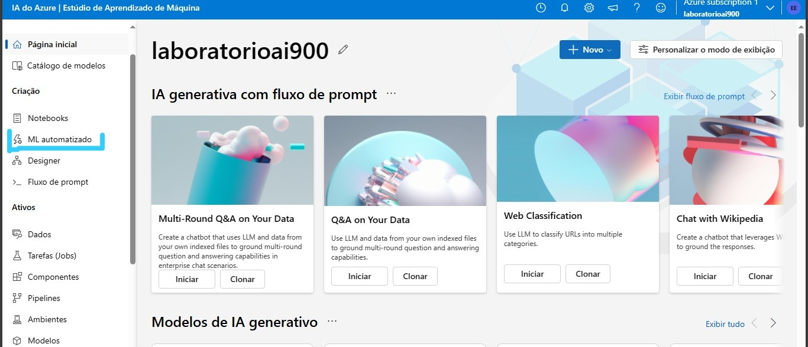

##

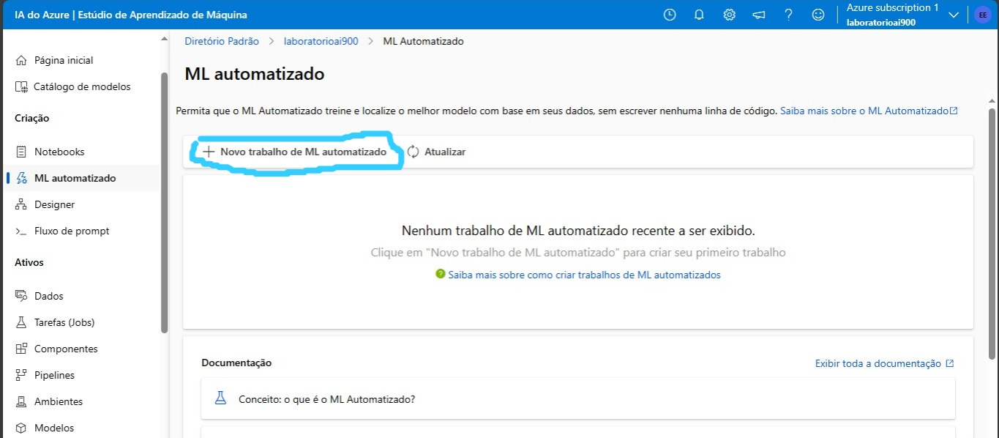


## Quando chegar na nova tela, deverá clicar em novo trabalho de ML automatizado para criar o projeto.

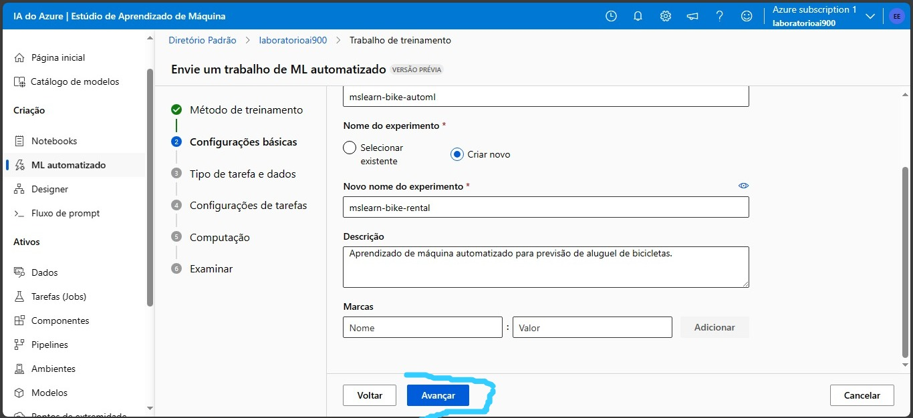

##  Na nova tela, é preferível que em nome de trabalho fique  "mslearn-bike-automl", em nome do experimento "mslearn-bike-rental" e em descrição "Aprendizado de máquina automatizado para previsão de aluguel de bicicletas." A parte "Marcas" pode permanecer vazia. Então deverá clicar em "Avançar"

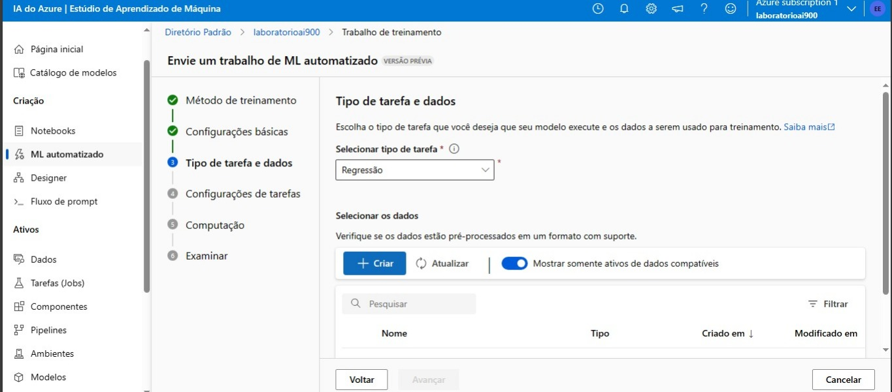

##  Em tipo de tarefa deverá selecionar "Regressão". Na parte de selecionar os dados deverá clicar em criar

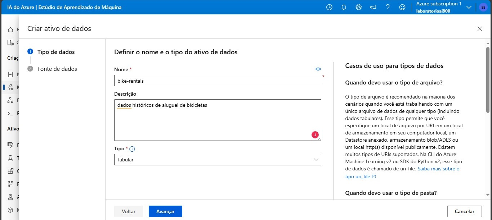

## Quando chegar na nova tela, em nome deve pôr bike-rentals, em descrição dados históricos de aluguel de bicicletas e em tipo ficará "tabular". Depois é só clicar em avançar


## Em fonte de dados colocar "de arquivos da web"

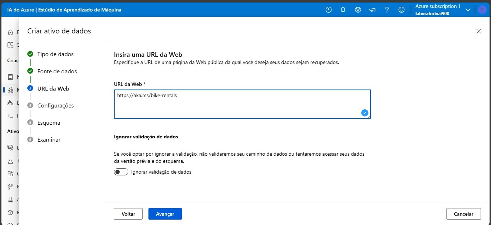

## Quando pedir o URL da web deverá ser posto https://aka.ms/bike-rentals e em ignorar validação de dados pode ficar desmarcado

## Abaixo estarão demasiadas configurações das etapas seguintes. Fique atento com cada configuração pois são importantes para o funcionamento seguir conforme esperado!.

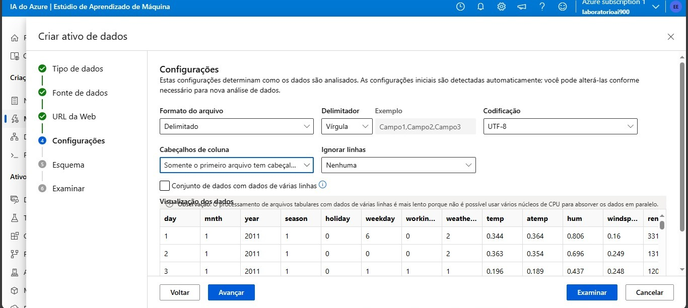
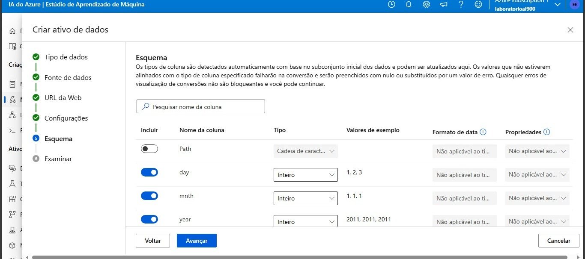
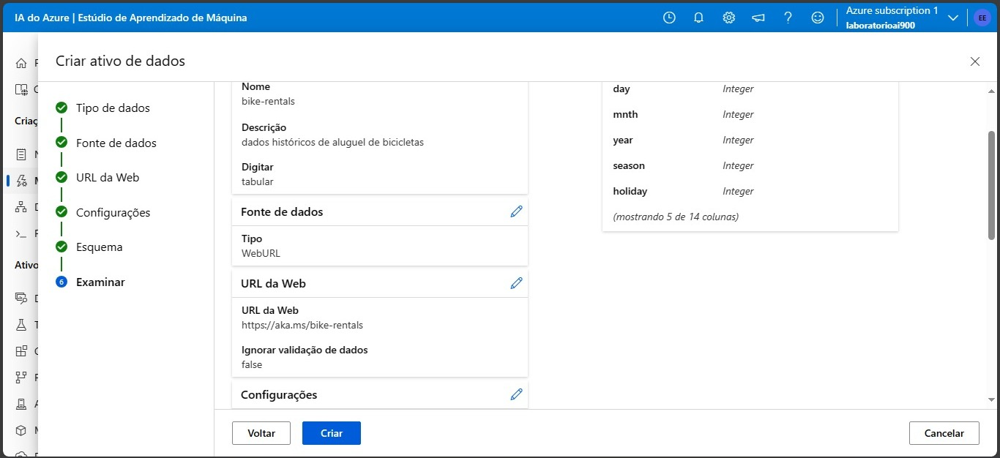
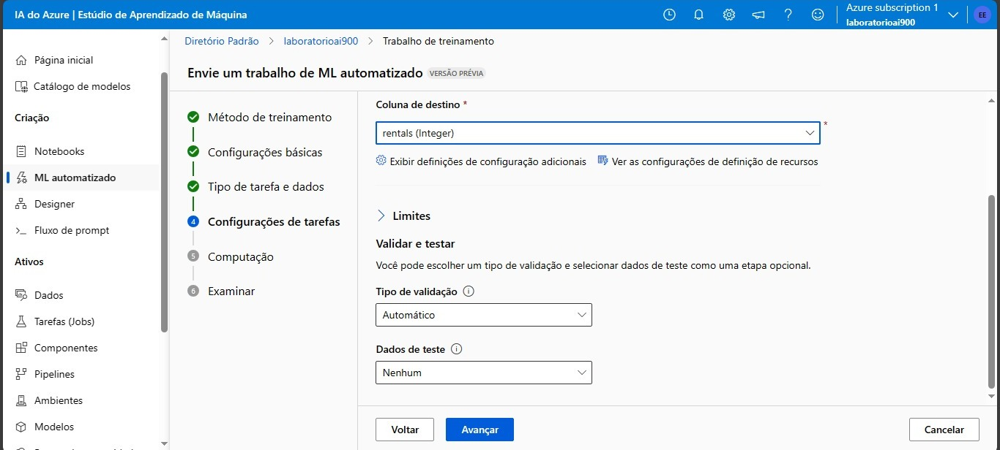


##
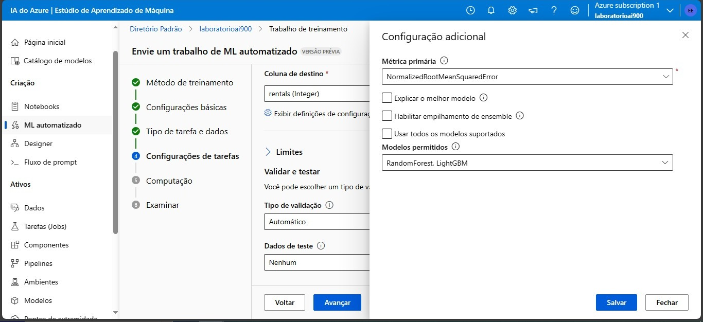

## deverá clicar em Exibir definições de configuração adicionais. Se estiver conforme o print acima, então pode prosseguir. Deixe as duas opções desmarcadas e então selecione RandomForest e LightGBM nos modelos permitidos.

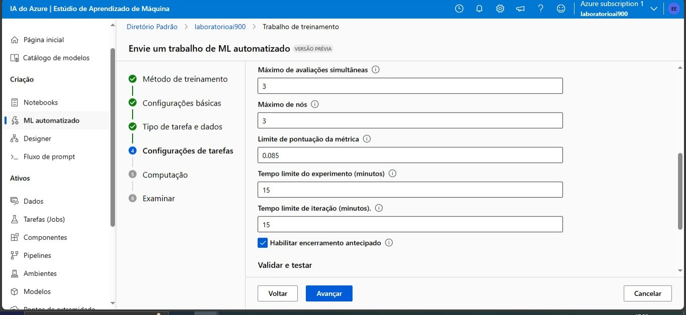

## A parte de limites deve estar conforme os dados fornecidos acima.


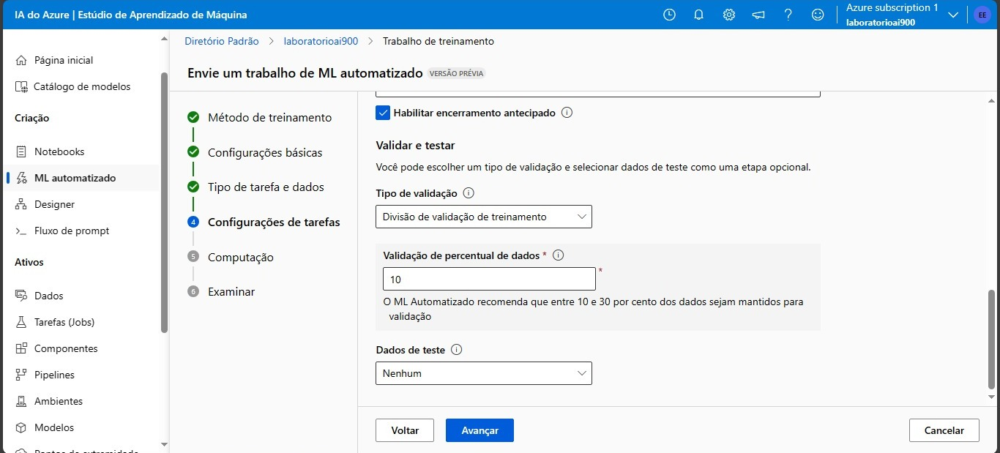
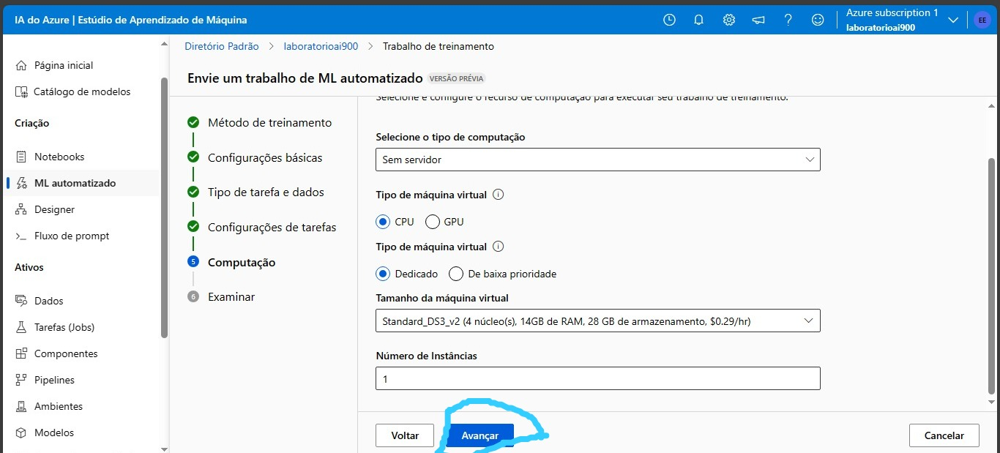

## Tipo de validação deve estar em Divisão de validação de treinamento. Seu valor deve continuar padrão (10) e dados de teste em nenhum. Após isso é só clicar em avançar.

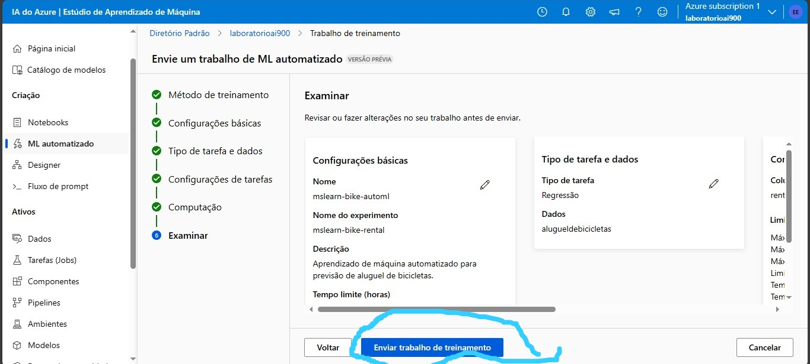

## Com todos os dados conforme o descrito, é só clicar em enviar trabalho de treinamento.

## Tendo todos os passos acima feitos, é necessário apenas aguardar em média 15 minutos para que tudo seja devidamente processado. Pode ser que leve menos tempo. 

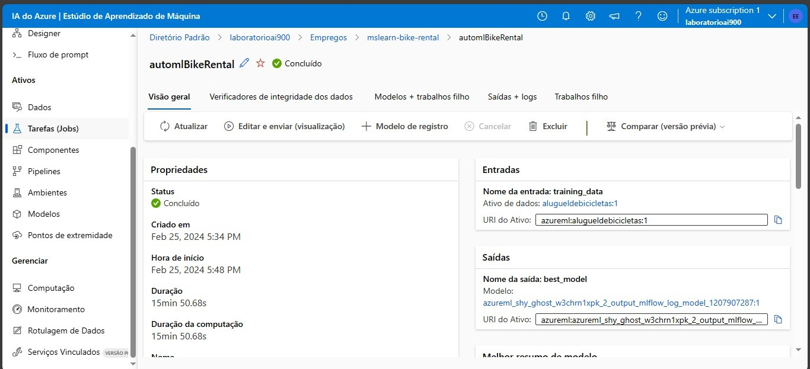

## Para ver os resultados é necessário criar um modelo. Para isso, clique em " + Modelo de registro ", selecione o nome e descrição desejados para o modelo e vá prosseguindo até ele ser criado. 

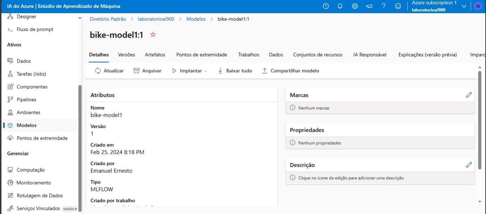

## Basta clicar pontos de extremidade, ir em "criar", selecionar o modelo que nós criamos anteriormente e  em seguida clicar em "implantar". Após isso aguarde alguns minutos, vá no nosso ponto de extremidade recém criado, clique em testar e coloque como parâmetros: 

```bash

# Parâmetros do Json

{
  "input_data": {
    "data": [
       {
         "day": 1,
         "mnth": 1,   
         "year": 2022,
         "season": 2,
         "holiday": 0,
         "weekday": 1,
         "workingday": 1,
         "weathersit": 2, 
         "temp": 0.3, 
         "atemp": 0.3,
         "hum": 0.3,
         "windspeed": 0.3 
       }
     ]
  }

# Resultado Esperado.

[
  361.95238671338427
]

```

# Feito isso, já é possível testar o modelo de aprendizado de Máquina que criamos. Para mais informações, você pode acessar a documentação da Microsoft na parte de "Links úteis."

## Links Úteis: 

[](https://microsoftlearning.github.io/mslearn-ai-fundamentals/Instructions/Labs/01-machine-learning.html)

