# Reconhecimento Facial e transformação de Imagens em Dados no Azure ML.

## As imagens utilizadas neste passo a passo estarão na pasta "Images" enquanto que as utilizadas para alimentar a IA estarão em "inputs". As saídas estarão na pasta "Output"

# Etapa 1 - Criação do recurso.

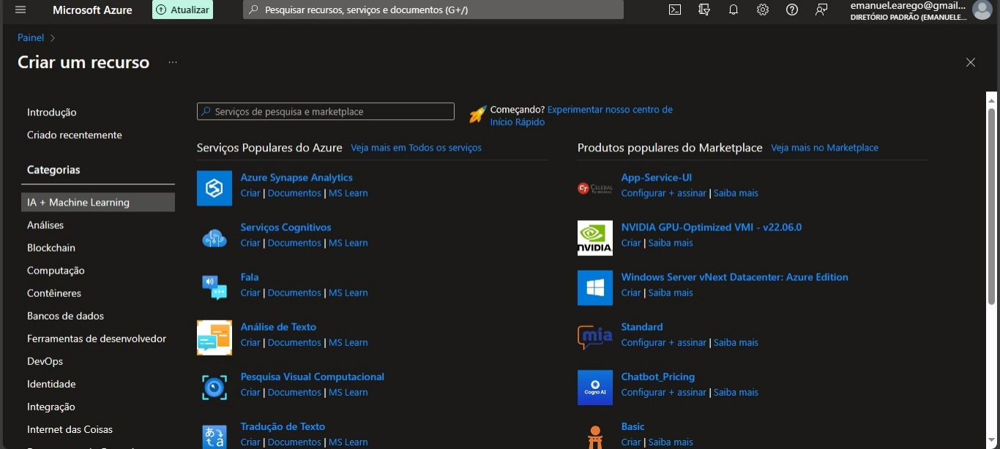

## Para iniciar, é necessário criar primeiramente um recurso. Para isso, clique em create a resource, ou "criar um recurso" a depender de seu idioma. Na nova tela, clique em "IA + Machine Learning" no canto esquerdo da tela e em seguida vá em "serviços cognitivos - criar" ou "Azure AI Services."

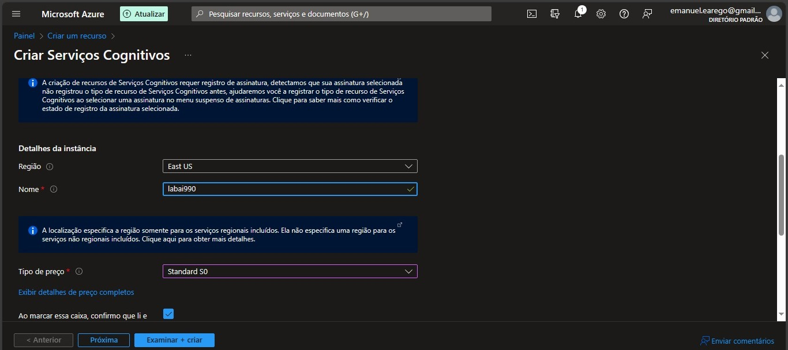

## Em resource group é só selecionar o grupo de recursos que você possui. Caso ainda não tenha, clique em criar e preencha as informações pedidas para criação de um novo resource group. Em região é preferível East US por ter um valor monetário menor nos gastos, em nome pode selecionar o que desejar e em tipo de preço Standard S0. Após isso é só marcar a caixa confirmando que leu os termos abaixo e clicar em Examinar + criar.

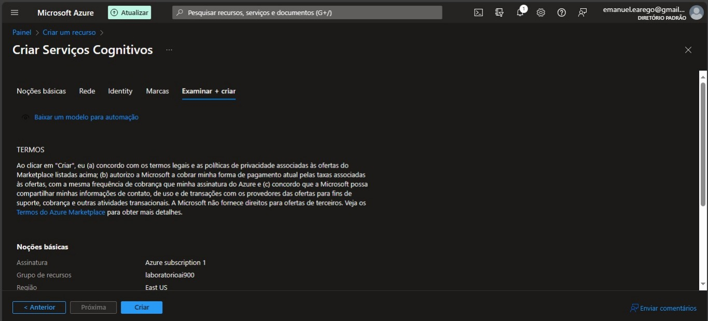

## É só clicar em criar que será criado seu recurso, então estará pronto para as próximas etapas.

# Etapa 2: Configuração no Azure Cognitive Vision

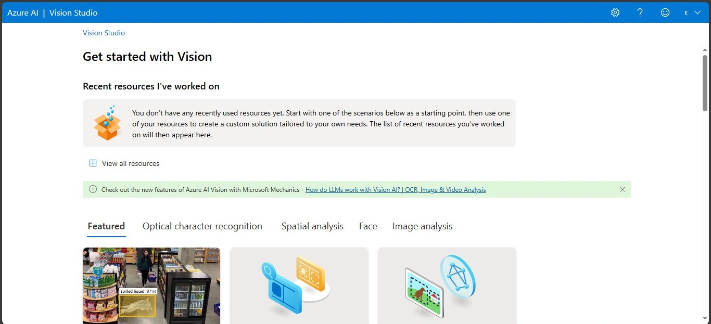

## Após concluir as etapas anteriores, acesse https://portal.vision.cognitive.azure.com/gallery/featured e clique em view all resources

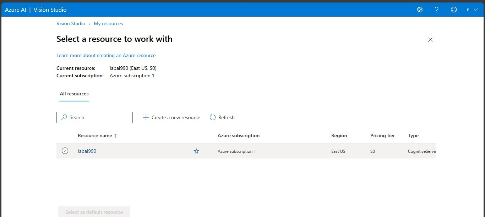

## Clique no ícone à esquerda do nome do seu resource, e após isso clique em select as default resource.

## Etapa 3 - Análise de imagens

### Caso tenha concluído as etapas passadas, agora é possível fazer a análise de imagens e documentos! 

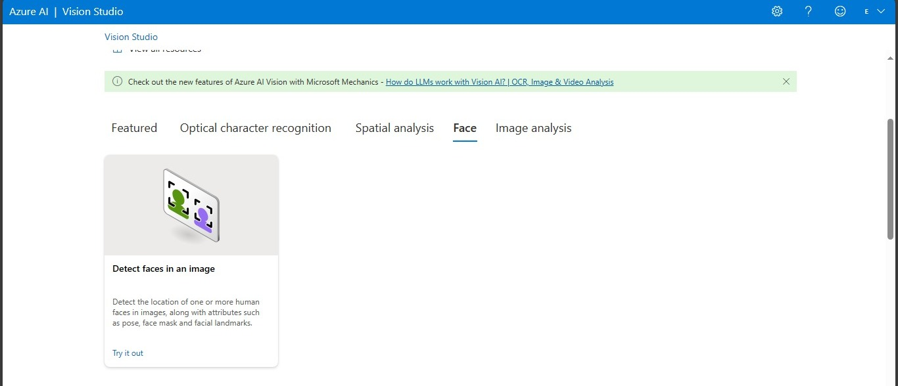

## Na página inicial do Vision Studio, ao descer um pouco a página, você deverá primeiro encontrar onde está o recurso para reconhecimento de imagens. Para exibir o serviço de reconhecimento facial, clique em "Face". Logo após, você verá a opção "detect faces in a image". A partir disso, clique em Try It out.

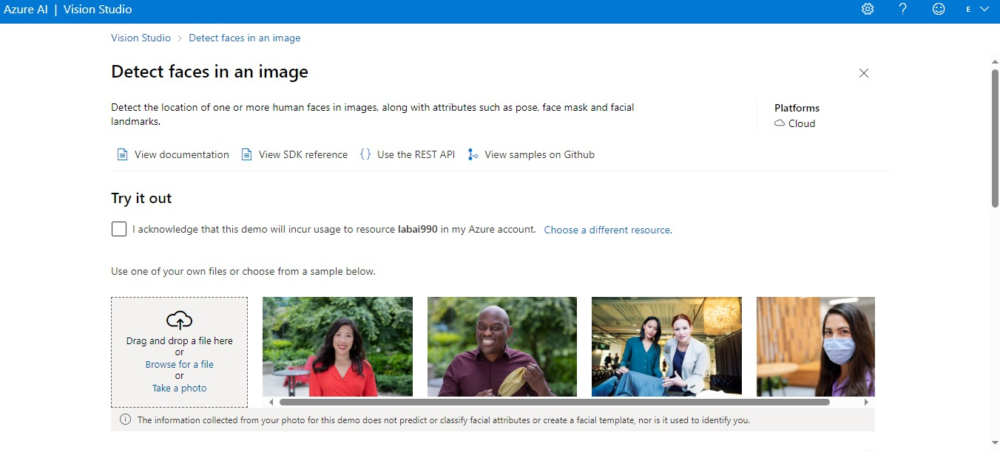

## Você será redirecionado a esta tela. Nela, haverão alguns exemplos de imagem que pode usar para testar o serviço de reconhecimento facial do Azure.

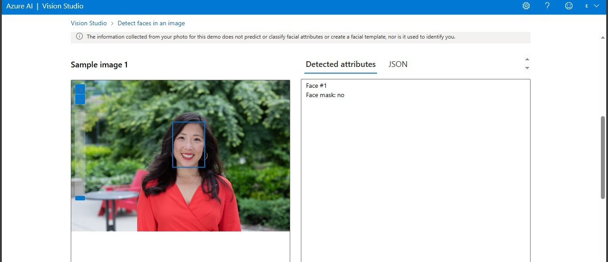

## Caso não queira utilizar uma de suas fotos, pode utilizar como exemplo as disponibilizadas. Ao clicar nelas e marcar a opção "I acknowlege that this demo will incur usage to resource..." você poderá ver informações como o número de rostos e se está usando máscara. 

### Para testes, será usada a imagem de um pôster do filme "John Wick 4."

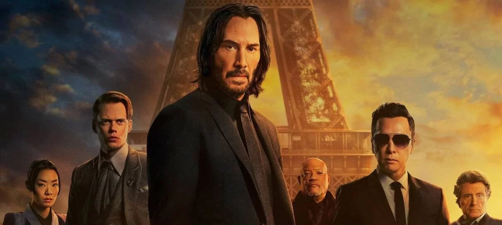

### A saída esperada é:

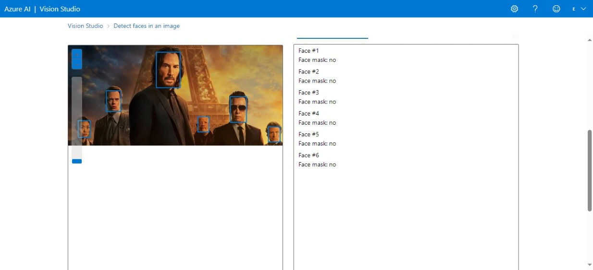

##

# Etapa 4 - Reconhecimento de documentos.

## Nesta etapa será feita a extração de textos em imagens.

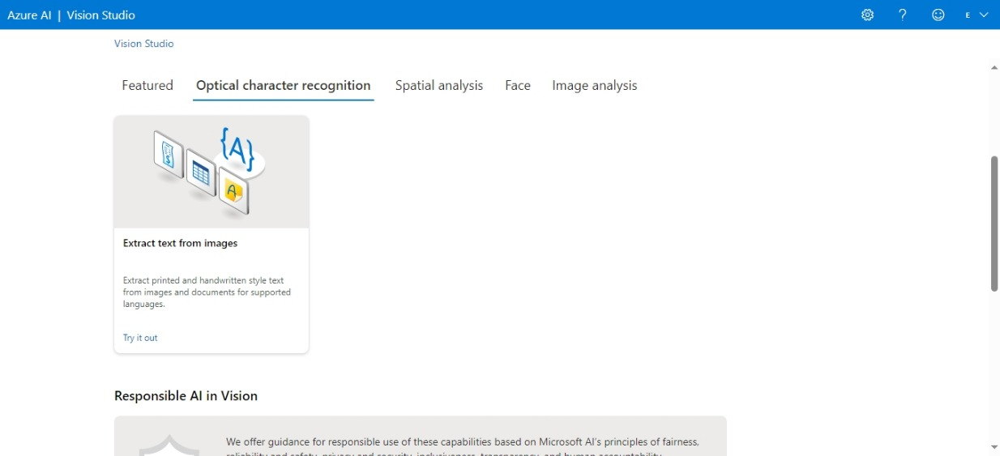

## Para começar, ao invés de clicar em "Face", desta vez deverá clicar em Optical character recognition, e logo após clicar em Try it out

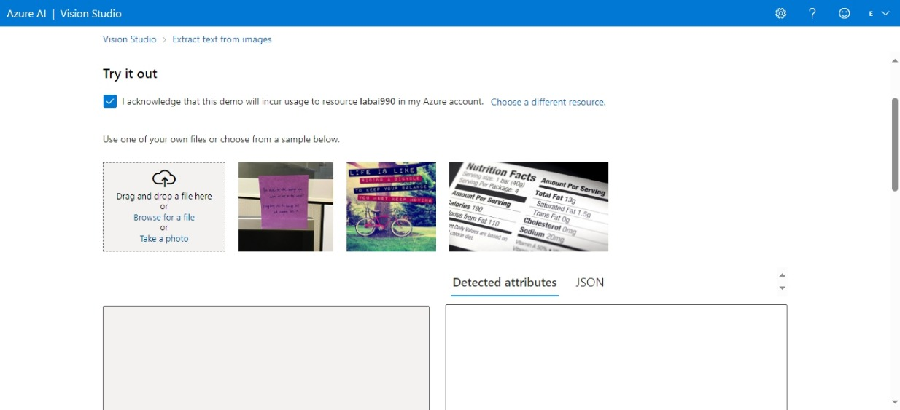

## Você poderá novamente escolher a imagem que desejar para tentar extrair o texto dela. Neste exemplo, utilizarei a do manifesto ágil.

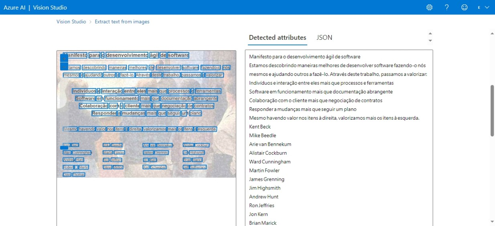

## Todo o texto da imagem, conforme esperado, foi digitalizado.

# Etapa 5 - Criação de legendas para imagens.

## Nesta etapa, será adicionado um "Caption" para a imagem selecionada.

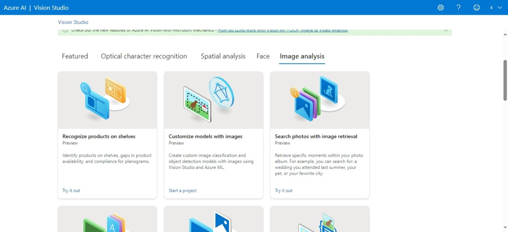

## Primeiro, você deverá selecionar "Image analysis", ir em "add caption to images" e clicar em try it out.

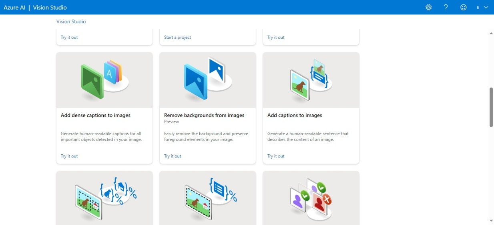

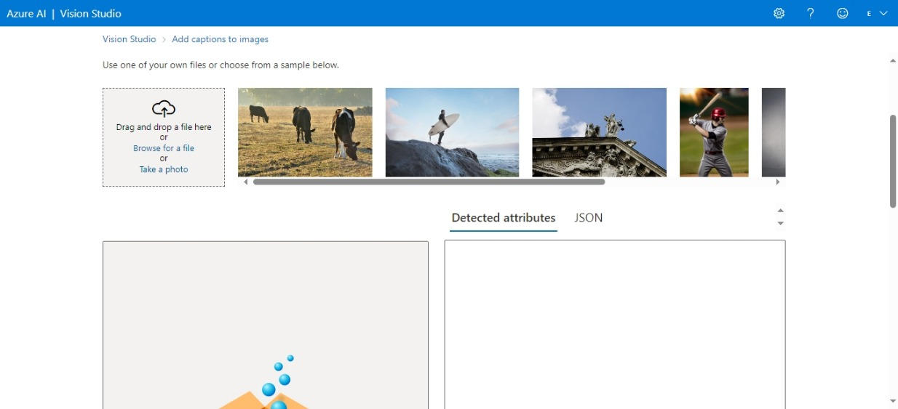

## Para o exemplo, utilizarei uma imagem extraída do evento MWC 2024.

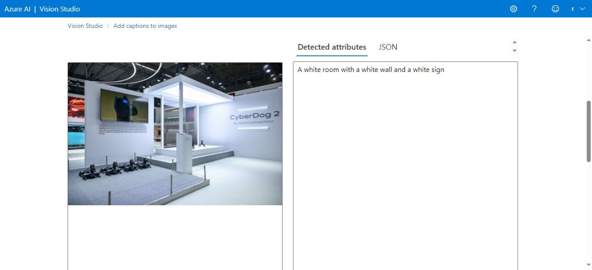

## O algoritmo reconheceu o ambiente e descreveu-o, havendo apenas um porém que foi ele não reconhecer os robôs caninos presentes tanto no chão quanto numa tela na parede.